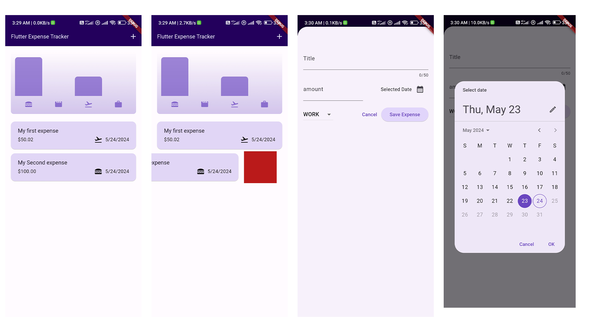
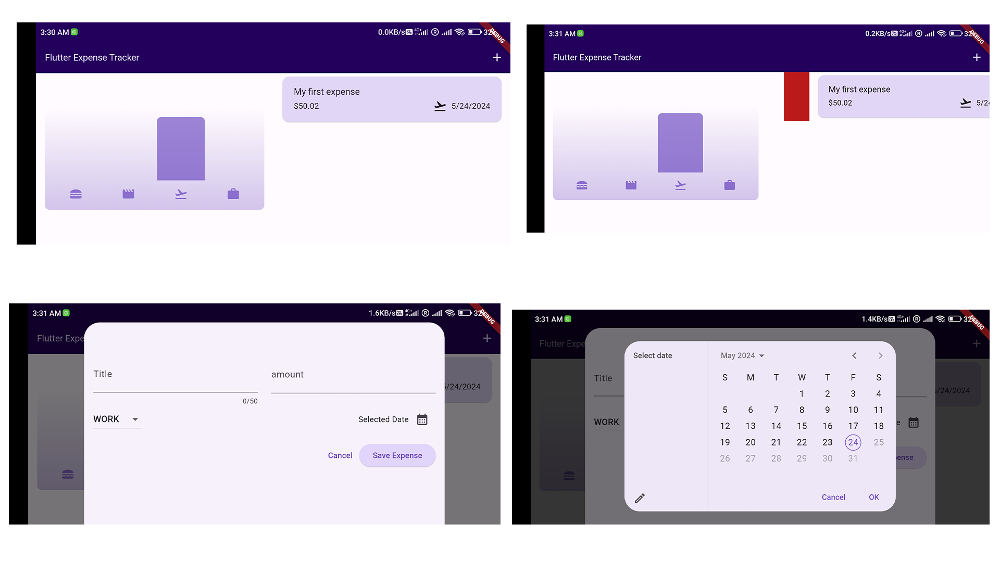
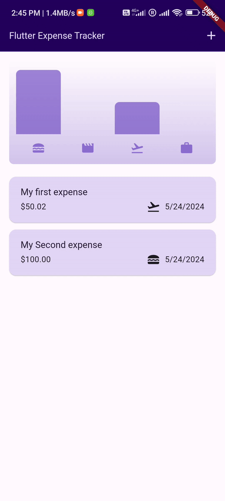

# Expense Tracker App
This application is a very simple application designed to learn some of the basics
of Flutter language, which is a program to track and record your daily expenses
such as eating expenses, travel and others

## Screenshots

  

  

  

## Features

This ِApp contains two screens:

`ِExpense screen` It contains all your expenses details in list  
`ِAdd expense screen` In this screen, you can add expenses by giving them the title
 and value of expenses, specifying the date and specifying the type of these expenses  

## Main Features

* dart
* flutter 
* google_font
* intl: 0.19.0
* uuid: 4.4.0
